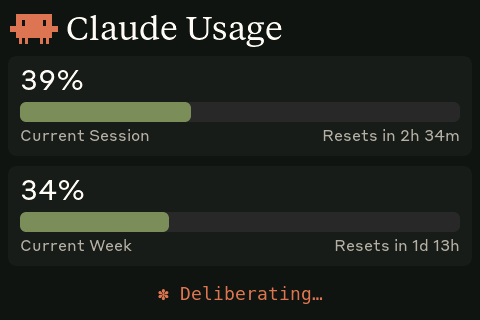
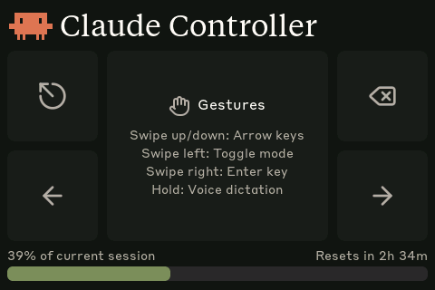
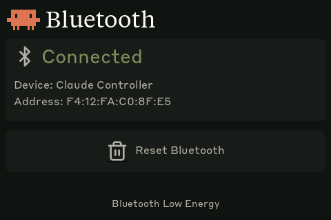

# Claude Usage Tracker - Panlee SC01 Plus

Bluetooth-connected Claude Code usage monitor and touch controller on a Panlee SC01 Plus (ESP32-S3) 3.5" touchscreen.


## Features

- **Usage dashboard** — Live 5-hour session and 7-day weekly utilization bars with color-coded thresholds
- **Touch controller** — Gesture-based Claude Code navigation (swipe, tap, hold) sent as BLE HID keyboard input
- **Bluetooth screen** — Connection status, device name, MAC address, bond management
- **Wireless** — All communication over Bluetooth Low Energy (USB only for charging and flashing)
- **Auto-reconnect** — Daemon discovers and reconnects automatically with exponential backoff

## Hardware

- [Panlee SC01 Plus](http://en.smartpanle.com/product-item-15.html) (WT32-SC01 Plus) — ESP32-S3, 3.5" 480x320 IPS, capacitive touch
- USB-C cable for flashing firmware and charging

## Prerequisites

- Linux (tested on Ubuntu)
- [PlatformIO CLI](https://docs.platformio.org/en/latest/core/installation/index.html)
- `curl`, `bluetoothctl`, `busctl` (BlueZ Bluetooth stack)
- Claude Code with an active subscription

## Flash the firmware

```bash
cd firmware
pio run -t upload --upload-port /dev/ttyACM0
```

## Bluetooth pairing

After flashing, the device advertises as **"Claude Controller"**. Pair it once:

```bash
# Scan for the device
bluetoothctl scan le

# When "Claude Controller" appears, pair and trust it
bluetoothctl pair F4:12:FA:C0:8F:E5    # use your device's MAC
bluetoothctl trust F4:12:FA:C0:8F:E5
```

The MAC address is shown on the Bluetooth screen (third screen, tap the logo to cycle).

## Install the daemon

The daemon polls your Claude usage every 30 seconds and sends it to the display over BLE.

```bash
./install.sh
systemctl --user start claude-usage-daemon
```

Check status: `systemctl --user status claude-usage-daemon`

View logs: `journalctl --user -u claude-usage-daemon -f`

## How it works

1. The daemon reads your Claude Code OAuth token from `~/.claude/.credentials.json`
2. Makes a minimal API call to `api.anthropic.com/v1/messages` (1 token of Haiku, essentially free)
3. Extracts usage data from the response headers (`anthropic-ratelimit-unified-5h-utilization`, etc.)
4. Connects to the ESP32 over BLE and writes a JSON payload to the GATT RX characteristic
5. The ESP32 parses it and updates the LVGL dashboard
6. Touch gestures on the Controller screen are sent as BLE HID keyboard input to the host

## Screens

Tap the Claude logo (top-left) to cycle between screens:

|              Usage              |                Controller                 |                Bluetooth                |
| :-----------------------------: | :---------------------------------------: | :-------------------------------------: |
|  |  |  |
| Session and weekly utilization  |      Touch zones and swipe gestures       |       Connection status and reset       |

## Gesture controls

On the **Controller** screen:

| Gesture       | Action                  |
| ------------- | ----------------------- |
| Swipe up      | Arrow Up                |
| Swipe down    | Arrow Down              |
| Swipe left    | Shift+Tab (toggle mode) |
| Swipe right   | Enter                   |
| Hold (center) | Space (voice dictation) |

Touch zones (tap):

| Zone         | Action      |
| ------------ | ----------- |
| Top-left     | Escape      |
| Bottom-left  | Arrow Left  |
| Top-right    | Delete      |
| Bottom-right | Arrow Right |

## BLE protocol

The device advertises a custom GATT service alongside the standard HID keyboard service:

|                            | UUID                                   |
| -------------------------- | -------------------------------------- |
| **Data Service**           | `4c41555a-4465-7669-6365-000000000001` |
| RX Characteristic (write)  | `4c41555a-4465-7669-6365-000000000002` |
| TX Characteristic (notify) | `4c41555a-4465-7669-6365-000000000003` |
| **HID Service**            | `00001812-0000-1000-8000-00805f9b34fb` |

JSON payload format (written to RX):

```json
{ "s": 45, "sr": 120, "w": 28, "wr": 7200, "st": "allowed", "ok": true }
```

Fields: `s` = session %, `sr` = session reset (minutes), `w` = weekly %, `wr` = weekly reset (minutes), `st` = status, `ok` = success flag.

## Recompiling fonts

The `firmware/src/font_*.c` files are pre-compiled LVGL bitmap fonts. If you need to regenerate them (e.g. to change sizes or add characters):

```bash
npm install -g lv_font_conv
```

Generate with `--no-compress` (required for LVGL 9):

```bash
# Tiempos Text (title)
lv_font_conv --font assets/TiemposText-400-Regular.otf -r 0x20-0x7E \
  --size 34 --format lvgl --bpp 4 --no-compress \
  -o firmware/src/font_tiempos_34.c --lv-include "lvgl.h"

# Styrene B (UI text)
lv_font_conv --font assets/StyreneB-Regular.otf -r 0x20-0x7E \
  --size 28 --format lvgl --bpp 4 --no-compress \
  -o firmware/src/font_styrene_28.c --lv-include "lvgl.h"

# DejaVu Sans Mono (animation, with spinner Unicode chars)
lv_font_conv --font assets/DejaVuSansMono.ttf \
  -r 0x20-0x7E,0xB7,0x2026,0x2722,0x2733,0x2736,0x273B,0x273D \
  --size 18 --format lvgl --bpp 4 --no-compress \
  -o firmware/src/font_mono_18.c --lv-include "lvgl.h"
```

**Important:** `lv_font_conv` v1.5.3 outputs LVGL 8 format. Each generated file must be patched for LVGL 9 compatibility:

1. Remove `#if LVGL_VERSION_MAJOR >= 8` guards around `font_dsc` and the font struct
2. Remove the `.cache` field from `font_dsc`
3. Add `.release_glyph = NULL`, `.kerning = 0`, `.static_bitmap = 0` to the font struct
4. Add `.fallback = NULL`, `.user_data = NULL` to the font struct

Without these patches, fonts compile but render as invisible.

## Converting Lucide icons

The controller screen uses [Lucide](https://lucide.dev) icons (the same icon set Anthropic uses). Icons are SVGs converted to RGB565 C arrays for LVGL.

1. Get Lucide SVGs from [github.com/lucide-icons/lucide](https://github.com/lucide-icons/lucide) (`icons/` directory)

2. Convert SVG to PNG at desired size:

```bash
inkscape icons/delete.svg --export-width=32 --export-height=32 \
  --export-filename=assets/icon_delete.png --export-background-opacity=0
```

3. Convert PNG to RGB565 C array:

```python
from PIL import Image

img = Image.open("assets/icon_delete.png").convert("RGBA")
bg = (0x1f, 0x1f, 0x1e)  # panel background color
fg = (0xb0, 0xae, 0xa5)  # icon stroke color

pixels = []
for y in range(img.height):
    for x in range(img.width):
        r, g, b, a = img.getpixel((x, y))
        alpha = a / 255.0
        out_r = int(fg[0] * alpha + bg[0] * (1 - alpha))
        out_g = int(fg[1] * alpha + bg[1] * (1 - alpha))
        out_b = int(fg[2] * alpha + bg[2] * (1 - alpha))
        rgb565 = ((out_r >> 3) << 11) | ((out_g >> 2) << 5) | (out_b >> 3)
        pixels.append(rgb565)

# Write as C array to firmware/src/icons.h
```

Current icons: `delete`, `arrow-left`, `arrow-right`, `circle-arrow-out-up-left` (escape), `hand` (gestures), `bluetooth`.

## Licensing gray area warning

The software in this repository uses and adheres to the Anthropic brand guidelines and uses the same proprietary fonts that Anthropic has a licnese for but this software uses without permission as well as using assets from Anthropic such as the copyrighted Claude Code mascot head logo so even though the code in this repo is non-proprietary I will not license it myself under a copyleft license since this repo includes proprietary fonts and copyrighted assets. Please be aware of this if you fork or copy the code from this repo. **You have been warned!**
